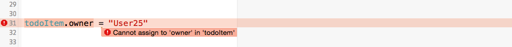

---
title: "Learn Swift by example - Part 1: Structs"
slug: structs-in-swift
---     

At Make School we have decided to switch from Objective-C to Swift for all of our new online content and courses. We get a lot of questions from the community regarding Swift:

* Should I learn Swift or Objective-C?
* Which of the two languages is easier to learn?
* What are the differences between Objective-C and Swift?

We will address all of these questions in a series of articles. This series will discuss the unique characteristics of the Swift programming language. We will add further parts to this series until we have covered most of Swift's language features. Understanding what is unique about Swift is a good way to decide wether to choose Objective-C or Swift for a new project.

We will start this series by discussing the concept of structs in Swift. As always we like to teach by example so you will be working with interactive playgrounds throughout this tutorial.

##Why are we starting this series with structs?

Why are we starting this series with structs? It turns out that, unlike in Objective-C, structs are a very powerful tool in Swift and can be used instead of classes in many cases. Most of the Swift standard library consists of structs. Throughout this first tutorial part we will discuss the most important characteristics of structs and when and how they can be used instead of classes.

##How is this different than the official Apple documentation?
Think of this tutorial series as a more accessible version of the [Apple language documentation](https://developer.apple.com/library/mac/documentation/Swift/Conceptual/Swift_Programming_Language/index.html). For each topic that we discuss we will have a bunch of examples which you can use in playground. We will modify these examples as we work through the tutorial. We discuss underlying principles in a little more detail to make this series more beginner friendly. We also prefer repeating some information multiple times if that makes it easier for you to learn Swift.

##What you need for this tutorial series
* Knowledge in any object oriented programming language
* MacOS with an Xcode Version of 6.1.1 or higher
* Optional: Objective-C knowledge, since we use Objective-C for comparison reasons

##What you're going to learn in this article

* Difference between value and reference types
* Some basic Swift syntax and language concepts
* What is new about structs in Swift? What is the same as in Objective-C?

##Structure of this article

One goal of this article is to show situations in which we can use structs instead of classes in Swift. What is the motivation for doing that in the first place? In Swift structs are *value* types while classes are *reference* types. Working with *value* types can make your code less error prone. We will start this article by discussing the differences between value types and reference types. 

Next we will look at the basic syntax for working with structs. We will discuss features that have already existed in Objetive-C.

In the last section we will discuss which struct features are new in Swift. These are the features that make structs a viable alternative to classes.

Enjoy! 

#Value types vs. reference types

The Swift language (as many other programing languages, too) provides two fundamentally different types: Value types and reference types. If you've coded in Objective-C you've worked with reference types almost the entire time, `NSArray`, `NSDictionary`, etc. are all reference types. Objective-C only has very few value types, e.g. `NSInteger` and `CGFloat`. 

##Reference types

The easiest way to explain the difference between value types and reference types is discussing their behavior when being assigned to variables. Let's first take a look at an example of a reference type in good old Objective-C:

	  NSMutableArray *array1 = [@[@(5), @(8), @(2)] mutableCopy];
	  NSMutableArray *array2 = array1;
	  [array1 addObject:@(10)];
	  // array1: [5,8,2,10]
	  // array2: [5,8,2,10]
	  
In the first line we create an array. Since `NSMutableArray` is a reference type, we are storing a *reference* to the array inside of the variable `array1`. Then we create a second variable `array2` and assign `array1` one to it. In this step the *reference* stored in `array1` gets copied into `array2`. Now `array1` and `array2` are referencing the same array object. If we change the array object through either of these two variables, the *same* array is modified. That means that the changes are reflected in both variables, even if the modification only happened through one of the two variables. 

A reference type can be referenced by multiple owners. Here's an illustration of what the ownership looks like after the four lines of code above:

##Value types

Value types behave different upon assignment. When a value type is assigned to a variable the variable always stores the *value* itself, not a *reference* to a value. This means whenever a value is assigned to a new variable, that variable gets its own copy of the *value*. A value can always only have one owner. In Swift Arrays are implemented as value types (they are structs!). So let's take a look at the same example in Swift:

	var array1 = [5,8,2]
	var array2 = array1
	array1.append(10)
	// array1: [5,8,2,10]
	// array2: [5,8,2]
	
In the first line we create the array. We assign it to the `array1` variable. At this moment the actual array instance is stored inside of that variable, *not a reference to the value*.

In the second line we declare a new variable called `array2` and assign `array1` to it. Since Arrays in Swift are value types and value types are copied when assigned to a variable, `array2` gets its private copy of the array stored in `array1`. In the last line we modify the the array stored in `array1`. 

This time the variable `array2` is not affected by this change, since it has its own private copy that is not affected by changes to the array stored in the `array1` variable. Here's what the ownership diagram looks like for this example:

 

Using value types instead of reference types can reduce the amount of bugs in your programs. As shown with this small example, making changes to reference types can have side effects that you might not intend. Every variable in your program that is referencing the same object will be effected by such changes. The design of the Swift standard library encourages using structs a lot more frequently than we did in Objective-C, that's why we've devoted this long article solely to structs. Let's dive into using them.

#Struct Basics

If you have programmed in C or Objective-C before you might be familiar with structs. However, structs in Swift are far more powerful than in C based languages. In Swift a struct is very similar to a class, you will learn the differences shortly. 

##Defining a basic struct

To follow along during this tutorial create a playground in Xcode:

Now, let's start by defining a first struct: 

	struct TodoItem {
	  var title: String
	  var content: String
	  var dueDate: NSDate
	  let owner: String
	}

First and foremost a struct is a collection of variables. This struct models a todo entry. The general syntax for declaring variables in Swift is:

* `var` or `let` keyword
* variable name + `:`
* variable type 

Later in this tutorial you will see that defining the type of a variable is not always necessary. For now however we will focus on the details of this struct.

Variables that belong to a struct are called *members*. The struct has three `var` members: `title`, `content` and `dueDate`. The values of these members can be changed throughout the lifetime of an instance of `TodoItem`. The struct also has one `let` member. The `let` keyword marks constants in Swift. This means that the owner string cannot be changed after a `TodoItem` has been created. 

##Initializing a basic struct 

Here's how you create an instance of this `TodoItem` struct:

	var todoItem = TodoItem(title: "Get Milk", content: "really urgent!", dueDate: NSDate(), owner:"User1")

If your struct does not define its own initializer Swift provides a default *memberwise initializer*. That memberwise initializer takes each of the fields of the struct as a parameter. This is also the default behavior for structs in Objective-C.

##Modifying a struct

Modifying struct instances in Swift works the same way as modifying class instances. Assume a user would want to change the title of a todo item. We can use this straightforward syntax to modify members:

	todoItem.title = "Get 2 Milk"
	
The playground should visualize that your struct has been updated correctly:

 

Modifying the owner on the other hand will not work because the `owner` member was marked as constant. Try this:

	todoItem.owner = "User25"

And you will see an error:
 

You can also create immutable instances of a struct. This means that once the instance is created none of the fields can be modified, not even the fields declared as `var`.
You can create an immutable instance by using the `let` keyword:

	let unchangeableTodoItem = TodoItem(title: "Get Milk", content: "really urgent!", dueDate: NSDate()	owner:"User1") 
	unchangeableTodoItem.title = "New Title"
	
When attempting to modify a field as in the code above, the compiler will display the following error:

#New in Swift

So far we have looked at the basics of structs in Swift, all of which are available in Objetive-C as well. Now we will dive into the more exciting features. In this section we will discuss features that make structs a great replacement for classes in many cases.

##Structs can have custom initializers

Earlier we mentioned the default *memberwise* initializer which is very similar to initializing structs in Objetive-C. In Swift, structs can have custom initializers. This is a broad topic because adding a custom initializer has a lot of side effects that we will discuss.

Let's start by adding an initializer. We want the user to be able to create a `TodoItem` only providing an `owner` but not a `title`, `content` or a `dueDate`:

	struct TodoItem {
	  var title: String
	  var content: String
	  var dueDate: NSDate
	  let owner: String
	  
	  init(owner:String) {
	    self.owner = owner
	  }
	}
	
	var todoItem = TodoItem(title: "Get Milk", content: "really urgent!", dueDate: NSDate(), owner:"User1")

Initializers can be created with the `init` keyword. Like regular methods they take a list of parameters, however they don't have a return type. All we need to do in the body of the initializer is map the parameters to member variables. In Swift the `self` keyword is optional. You only are forced to use it in situations as shown above where a parameter name and a member name are the same.

You will realize that the above code does not run in the playground:

When we implement a custom initializer, Swift no longer provides the default *memberwise* initializer. In many cases this is OK. If however, you want to keep the memberwise initializer and simply provide an additional initializer you can add the initializer to an extension instead of adding it to the struct directly (Extensions will be discussed in a future tutorial):

	struct TodoItem {
	  var title: String
	  var content: String
	  var dueDate: NSDate
	  let owner: String
	}

	extension TodoItem {
	  init(owner:String) {
	    self.owner = owner
	  }
	}

	var todoItem = TodoItem(title: "Get Milk", content: "really urgent!", dueDate: NSDate(), owner:"User1")

With this solution you will still run into a compiler error:

What's the problem here? 

[Apple's documentation](https://developer.apple.com/library/ios/documentation/Swift/Conceptual/Swift_Programming_Language/Initialization.html) states:
> "Classes and structures must set all of their stored properties to an appropriate initial value by the time an instance of that class or structure is created. Stored properties cannot be left in an indeterminate state."

With the initializer we are currently providing we are only setting one out of four values. The values for `title`, `content` and `dueDate` are undetermined when the initializer completes. As shown in the quote this is not allowed in Swift. How can we change the code to compile? There are three options:

* assign some value for the other three members inside of the initializer
* set a default value for each of the three members
* mark the three members as *Optional* so that they are allowed to have no value after initialization

###Option 1

The first solution is pretty easy, simply change the initializer to look like this:

	extension TodoItem {
	  init(owner:String) {
	    self.owner = owner
	    self.content = "Default content"
	    self.title = "Default title"
	    self.dueDate = NSDate()
	  }
	}
	
Now we are assigning values to all members and the Swift compiler is satisfied. Finally we can use our new initializer that only takes one parameter:

	var todoItem2 = TodoItem(owner: "User29")

###Option 2

The second solution is assigning default values outside of the initializer, directly as part of the variable declaration. Default values are another new feature in Swift that did not exist in Objective-C. 

With the second solution our new struct and the extension with the initializer look like this:

	struct TodoItem {
	  var title     = "Default title"
	  var content   = "Default content"
	  var dueDate   = NSDate()
	  let owner: String
	}

	extension TodoItem {
	  init(owner:String) {
	    self.owner = owner
	  }
	}
	
This second solution has a big advantage when you add multiple different initializers - you won't have to repeat the default values inside each of these initializers. Another side effect of assigning default values is that we no longer need to declare the type of variables. This Swift feature is called *type inference*. The compiler automatically detects the type of the value that we are assigning to a variable.

###Option 3

The third possible solution for implementing an initializer that does not receive values for all members is using *Optionals*. Optionals are a new feature in Swift. They are essential and we will discuss them in detail in  a separate tutorial. For now it is enough to know that Optionals are a way to represent values that can contain nothing. Here's what our struct could look like when using Optionals, indicated by adding a `?` after the type:

	struct TodoItem {
	  var title: String?
	  var content: String?
	  var dueDate: NSDate?
	  let owner: String
	}

	extension TodoItem {
	  init(owner:String) {
	    self.owner = owner
	  }
	}

When we mark the type of a variable as optional we tell the compiler that it is OK if this variable contains no value. Since it is OK for Optionals to contain nothing we are not forced to set an initial value in the initializer. As mentioned earlier we will discuss Optionals separately, for now we'll just remember how they can be used when initializing structs.

##Structs can have methods
This is another big difference between C language structs and Swift structs. Formerly structs could only store data, now they can also perform actions. Let's assume we want to present a string in an app that summarizes some information about a todo item. We can add a method to compute that string to our `TodoItem`:

	struct TodoItem {
	  var title     = "Default title"
	  var content   = "Default content"
	  var dueDate   = NSDate()
	  let owner: String
	  
	  func summary() -> String {
	    return "\(title) belongs to \(owner)"
	  }
	}
	
The `func` keyword is used for functions and methods in Swift. It is followed by the method name and a parameter list in parentheses. This function takes no parameters since it only operates on the members of the struct. The `->` symbol is placed in front of the return type of Swift methods. Our example method returns a String.

We can call this method the same way as we would on a class:

	todoItem.summary()
	
You should see the following output:

There's a special rule for methods that make changes to structs. Assume you want a function that sets the due date of a todo item to today. The straightforward implementation would be adding the following function to your struct (`NSDate()` creates a date instance with the current timestamp):

	func makeDueToday() {
	  dueDate = NSDate()
	}
	
If you do that you will once again see a compiler error:

Why? 

By default instance methods of structs cannot modify instance variables. In the last part of this tutorial we will see why this default behavior makes sense for the most ways we use structs in Swift. 
However, this default behavior can be changed with the `mutating` keyword. By adding the keyword `mutating` to a function we indicate that this function wants to change instance variables of the struct:

	mutating func makeDueToday() {
     dueDate = NSDate()
	}
	
Now we can call the function and change the `dueDate`:

	var todoItem = TodoItem(title: "Get Milk", content: "really urgent!", dueDate: NSDate(timeIntervalSinceNow: 60000), owner:"User1")
	todoItem.makeDueToday()
	
You might have guessed it: mutating functions can only be called on structs that are stored in mutable variables (keyword `var`)! Remember, if we store a struct in a variable marked as immutable (keyword `let`) then the struct itself can never be modified. Therefore we also can't call methods that would modify the struct:

	let todoItem = TodoItem(title: "Get Milk", content: "really urgent!", dueDate: NSDate(timeIntervalSinceNow: 60000), owner:"User1")
	todoItem.makeDueToday()
	
You will see this compiler error:

##Structs can implement protocols

Since structs in Swift can implement methods they can also confirm to protocols! In practice however this functionality is still pretty limited. Most of the protocols you use when writing iOS apps are currently defined as *Class-Only Protocols* which means that they cannot be implemented by structs. We will discuss protocols in Swift in a later article and revisit how they can be used with structs.

#Conclusion

Why do we think structs are important enough to start our Swift series with discussing them? You will realize that working with structs for modeling some of your app's data can often be easier than using classes. 

As discussed at the beginning of this post, structs are value types. That means they can only have one owner and are always copied when assigned to a new variable or sent to a method or function. That makes your code inherently safer; making changes to a struct will not affect other parts of your program. For this reason most of the Swift standard library uses structs instead of classes, Arrays, Dictionaries, etc. are all structs. 

Additionally the `let` keywords allows us to create immutable struct instances. If we have data that should not be changed after initialization we can ensure that at compile time when using structs (that is not true for classes as we will see soon!). 

Best practices for Swift are still about the evolve, it will be interesting to see how many developers will use structs over classes.

If you want to learn more about Swift and ship your own original iPhone App or iPhone Game you should attend our [Summer Academy](https://makeschool.com/apply?referrer=54750)!

Stay tuned for more tutorials of this series!

